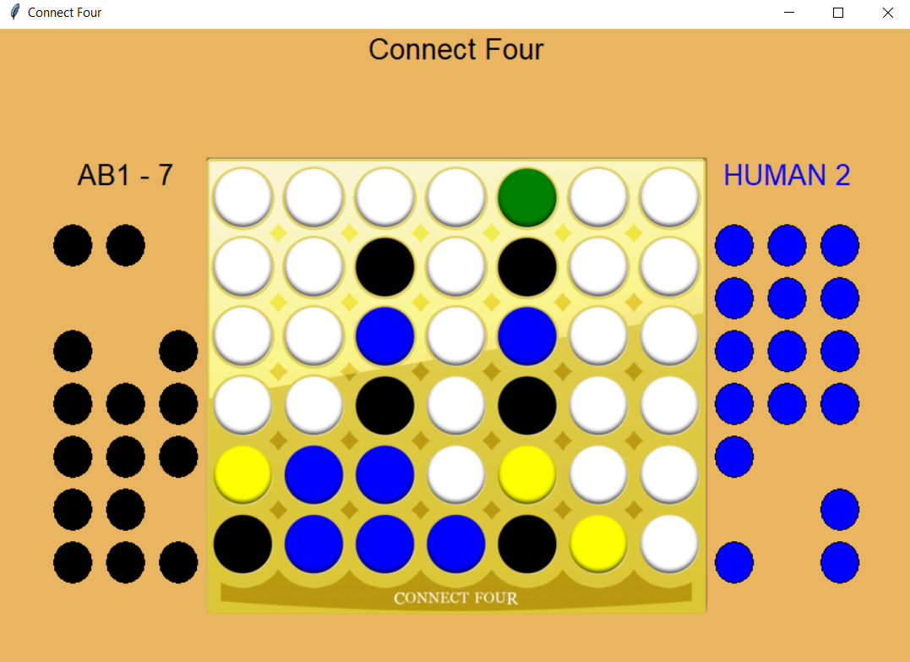

# **Twisted Connect Four** #
This game is like the regular Connect Four game but with a few additions:
1. There are two AI players: AlphaBeta and Expectimax (alongside a human player)\
which their depths can be adjusted (see instructions below).
2. Number of columns can be adjusted (see instructions below).
3. There are 2 additional discs in the game: yellow which interferes both players\
and green which helps both players. These discs can randomly be in the board according
to the gamma factor (which can be adjusted, instructions below).\
This means that if for example,
gamma is 0.5 then there is a probability of 0.5 to a random move to occur after each of the player's move.\
In this random move one of each of 4 discs can appear anywhere in the board: disc of player 1, disc of player 2, 
yellow disc or green disc.

The game's GUI was implemented using tkinter library, a picture from a game:

### In order to run the code you should install numpy and numba libraries by running this code: ###
"pip install numpy"\
"pip install numba"\
numba is just-in-time compiler (for better runtime).\
That's why when you run the code, at first it takes some time to process it,
and then it runs smoothly so please be patient and enjoy :)

Example of a player's name:\
&nbsp;&nbsp;If it is an AI player:\
&nbsp;&nbsp;&nbsp;&nbsp;&nbsp;&nbsp;&nbsp;AB1 - 4\
&nbsp;&nbsp;&nbsp;&nbsp;# AB - alpha beta player\
&nbsp;&nbsp;&nbsp;&nbsp;# 1 - player 1\
&nbsp;&nbsp;&nbsp;&nbsp;# 4 - depth of AI player\
&nbsp;&nbsp;If it is a Human player:\
&nbsp;&nbsp;&nbsp;&nbsp;&nbsp;&nbsp;&nbsp;HUMAN 1\
&nbsp;&nbsp;&nbsp;&nbsp;# HUMAN - human player\
&nbsp;&nbsp;&nbsp;&nbsp;# 1 - player 1

If you want to play the game you should run this command:
>    "python main.py <num of columns: integer which is 7 and above> <gamma:number between 0 and 1>
            <AlphaBeta depth: integer between 1 and 7> <Expectimax depth: integer between 1 and 2>"
 
>    Example: "python3 main.py 7 0.5 5 2"
    # 7 - number of columns in the game
    # 0.5 - gamma factor: the probability of a random move to occur
    # 5 - AlphaBeta depth
    # 2 - Expectimax depth